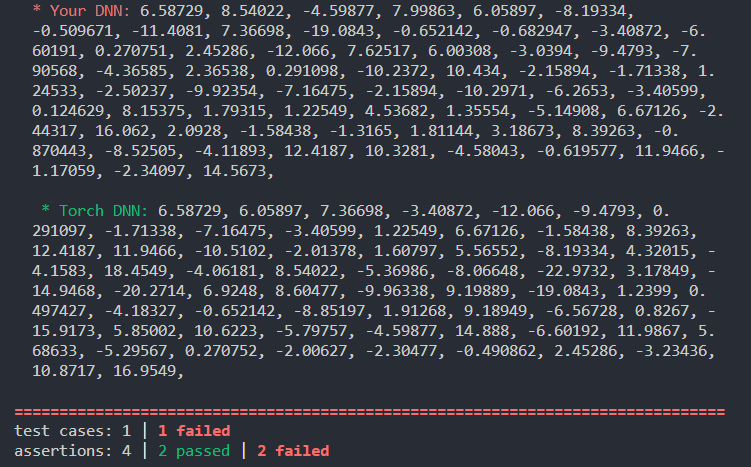
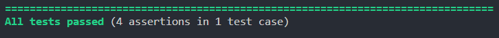

# nnTest -- A DL Library Testing Framework.
nnTest mainly focuses on providing a testing framework that helps you train and inference Deep Neural Networks using YOUR OWN LIBRARY.

In this repo, we 
* integrate libtorch to serve as the computation library that generates ground truth for your own library implementation.
* use CATCH2 as the easy-to-use unit testing framework.
* provide a example that uses CUDA and cuBLAS to implement both the FWD and BWD pass of Linear Layer in DNN.


<center></center>
<center> 2 tests pass and 2 tests fail.</center>
<center></center>
<center> All tests pass.</center>

# How to use the framework
## clone and install LibTorch
To clone this repo, use
```
git clone https://github.com/jundaf2/dnn-test-framework
```
To install the libtorch using pytorch submodule,
```
git clone https://github.com/pytorch/pytorch --recursive && cd pytorch
git submodule sync
git submodule update --init --recursive

cd pytorch
export USE_CUDA=False
export BUILD_TEST=False
python ./tools/build_libtorch.py
```
Copy the following folders to `libtorch/include`
- `pytorch/torch/include/torch`
- `pytorch/torch/include/caffe2`
- `pytorch/torch/include/c10`
- `pytorch/torch/include/ATen`
- `pytorch/torch/include/TH*`

Copy the following shared library to  `libtorch/lib`. 
- `pytorch/build/lib/libtorch.so`
- `pytorch/build/lib/libtorch_cpu.so`
- `pytorch/build/lib/libc10.so`

Copy `pytorch/torch/share/cmake` to  `libtorch/share`. 

Finally, you will get the libtorch subdirectory as follows.
```
libtorch
├─include
│ ├─ATen
│ ├─c10
│ ├─caffe2
│ ├─TH
│ ├─THCUNN
│ ├─THNN
│ └─torch
├─lib
│ ├─libc10.so
│ ├─libtorch.so
│ └─libtorch_cpu.so
└─share
  └─cmake
```
In short, you can use the following cli command to do the above operations. In the folder (project source folder) where `/pytorch` locates,
```
mkdir libtorch && mkdir libtorch/lib && mkdir libtorch/include && mkdir libtorch/share
cp -r pytorch/torch/include/torch pytorch/torch/include/caffe2 pytorch/torch/include/c10 pytorch/torch/include/ATen pytorch/torch/include/TH* libtorch/include
cp pytorch/build/lib/libtorch.so pytorch/build/lib/libtorch_cpu.so pytorch/build/lib/libc10.so libtorch/lib
cp -r pytorch/torch/share/cmake libtorch/share
```
## nnTest APIs

### public APIs (use outside the class)
* `virtual void init_data()`
* `virtual void run_torch_dnn()`
* `virtual void run_my_dnn()`
* `void verify()` (Already written, no need to override or modify)

### protected APIs (use inside the class)
The generated data and the data registered to be tested assume the data has been linearized in a row-major (C/C++/CUDA default) manner. While BLAS and Eigen assumes data are stored in a col-major manner.

1. When overriding `init_data`
    * `void set_random_seed(unsigned int random_seed)`
    * `void set_print_el_num(int n)` How many 
    * `std::vector<float> gen_rand_input(float rand_min, float rand_max, size_t len)`
    * `std::vector<float> gen_constant_input(float c, size_t len)`
    * `void set_input_vec(const float* x, size_t len, std::string name)`
2. When overriding `run_torch_dnn`
    * `void get_input_ten(torch::Tensor& ten, std::string name, torch::TensorOptions options)`
    * `void register_torch_test_data(const torch::Tensor& x, std::string name)`

3. When overriding `run_my_dnn`
    * `std::vector<float> get_input_vec(std::string name)`
    * `void register_raw_test_data(const float* x, size_t len, std::string name)`
4. Some logistics
    * `void print_vec(const std::vector<float> outv, std::string outn, int start = 0)`
    * `std::string print_str_vec(const std::vector<float> outv, int start)`
    * `void print_ten(const torch::Tensor& x, std::string name)`

In short, the `register_raw_test_data` that register variables generated by your own DNN implementation and `register_torch_test_data` that register variables computed by Torch should register an exact same set of names of variables with exactly the same length.

## nnTest example
### create a class for your DL module in a LibTorch fashion
Here we only provide skeleton, for the detailed example, see `main.cc`

```
struct test_Linear : public nn_test::nnTest, torch::nn::Module {
private:
    torch::nn::Linear linear{nullptr};
    unsigned batch, in_features, out_features;
public:
    // constructor
    test_Linear(int batch, int in_features, int out_features){
        this->linear = register_module("linear", torch::nn::Linear(in_features, out_features));
    }

    // init and register data
    void init_data() override{
        this->set_random_seed(seed);
        this->set_print_el_num(64); // how many elements is output

        this->set_input_vec(this->gen_rand_input(-rand_range,rand_range,weight_len).data(), weight_len, "linear_weight");
        this->set_input_vec(this->gen_rand_input(-rand_range,rand_range,bias_len).data(), bias_len, "linear_bias");
        this->set_input_vec(this->gen_rand_input(-rand_range,rand_range,in_data_len).data(), in_data_len, "linear_in");
        this->set_input_vec(this->gen_rand_input(-rand_range,rand_range,out_data_len).data(), out_data_len, "target");
    }

    // Your DNN routine
    void run_my_dnn() override{
        // Register the data to be test
        this->register_raw_test_data(output, batch*out_features, "output");
        this->register_raw_test_data(linear_in_grad, batch*in_features, "linear_in_grad");
        this->register_raw_test_data(linear_weight_grad, in_features*out_features, "linear_weight_grad");
        this->register_raw_test_data(linear_bias_grad, out_features, "linear_bias_grad");
    }

    // Torch DNN routine
    void run_torch_dnn() override{
        // Register the data to be compared with
        this->register_torch_test_data(linear_out, "output");
        this->register_torch_test_data(linear_in.grad(), "linear_in_grad");
        this->register_torch_test_data(this->linear->weight.grad(), "linear_weight_grad");
        this->register_torch_test_data(this->linear->bias.grad(), "linear_bias_grad");
    }
}
```
### Initialize nnTest && Add test cases and sections.
```
int eval_linear(unsigned batch, unsigned in_features,unsigned out_features){
  test_Linear test_linear(batch,in_features,out_features);
  test_linear.init_data();
  test_linear.run_my_dnn();
  test_linear.run_torch_dnn();
  test_linear.verify();
}

TEST_CASE("Linear", "[Linear Layer]") {
  SECTION("[4,50,100]") {
    eval_linear(4,50,100);
  }
}
```

## Specs
### What is to be initialized:
* weights
* input data
* target data

### What is to be tested:
* forward result of the network output
* forward result of the potential intermediate variables
* backward gradients of the weights
* backward gradients of potential intermediate variables 

## Linear Layer and MSE Loss
### Theory
See the Pytorch documentations,
* https://pytorch.org/docs/master/generated/torch.nn.Linear.html
* https://pytorch.org/docs/master/generated/torch.nn.MSELoss.html#torch.nn.MSELoss
### Implementation
Some unoptimized kernels are in `linear_layer_kernels.cu`. GEMMs are based on the cuBLAS.

## Multi-head Attention implemented in Eigen using nnTest
See https://github.com/jundaf2/eigenMHA

